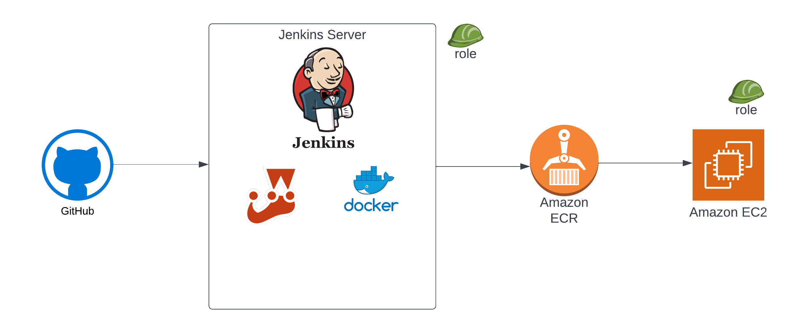

# Overview

This project demonstrates the configuration of a CICD pipeline for an Angular application using Jenkins. The pipeline processes include building the Docker image, running tests, pushing the image to AWS ECR, and deploying to an EC2 instance.

## Architecture

## Prerequisites 

- Jenkins server (remote or on local machine)
- Docker installed on Jenkins Server.
- Jenkins Plugins 
- Server to deploy. (Could be same Jenkins server) 
- - Bitbucket
- - SSH Agent
- - Docker

## Permissions and Credentials Required
- IAM Role for Jenkins server. (Policies: ECR full access, EC2 full access)
- IAM Role for deployment server. (Policy: ECR full access)
- Bitbucket \ Github credentials in case of private repo.
- SSH credentials of deployment server.

## Project Structure

- `src/`: Contains the source code of the Angular application.
- `Jenkinsfile`: Jenkins pipeline script for building and deploying the project.
- `Dockerfile`: Dockerfile for containerizing the Angular application.

## Pipeline Stages:

- `'Build Image:` This stage builds a Docker image of our Angular application.
- `Test:` Runs the tests using npm test.
- `Logging into AWS ECR on CICD server:` Log in to the AWS ECR to push the Docker image after building it.
- `Push Docker Image to ECR:` Pushes the built Docker image to the AWS ECR repository.
- `Deploy to EC2:` Deploy the Docker container to an EC2 instance.

## How to use

1. **Setup AWS Credentials:** 
    - Replace placeholder values like "your aws account" with your actual AWS account details and other placeholders as needed.
2. **Jenkins Setup:** Ensure Jenkins is set up with necessary plugins and credentials.
    - Ensure Jenkins is set up with necessary plugins and credentials.
    - Configure Jenkins to monitor your repository for any pushes. This can typically be done using webhooks or polling Each time code is pushed to your repository, Jenkins will checkout the latest code and trigger the pipeline.
3. **Push Changes to Repository:** 
    - Once you're ready to initiate the CICD process, simply push your changes to the repository. Jenkins will detect the push, checkout the code, and run the pipeline stages.
4. **Verify Deployment:** 
    - Once the pipeline completes successfully, access your application on the EC2 instance to verify the updates.

## Useful Links
- Node.js and npm: Ensure Node.js and npm are installed on your system. You can download them from [Node.js](https://nodejs.org/).
- Docker: Install Docker to build and run the Docker container. You can download Docker from [Docker](https://www.docker.com/).

